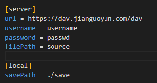

# WebDav Sync Tool

## 功能
- [x] 将远端WebDav服务器指定路径下全部内容下载至本地指定路径
- [ ] 启动一个简易本地WebDav服务,并同步推送更改至远端服务器

## 使用说明
本工具适用于Windows和Linunx。

### 如何运行
根据运行环境下载本软件，在同级目录创建conf.ini文件并写入对应配置(参考[conf.ini](./main/conf.ini))

windows下双击运行即可，如运行异常需要查看日志时用CMD运行即可查看

linux下赋予二进制文件执行权限后即可

### 配置文件说明
使用本工具前需要准确填写配置文件(conf.ini)

以坚果云Webdav为例

savePath是从远端下载的文件存放在本地的路径，可以是绝对路径或相对路径(Linux Windows 路径格式都行)

